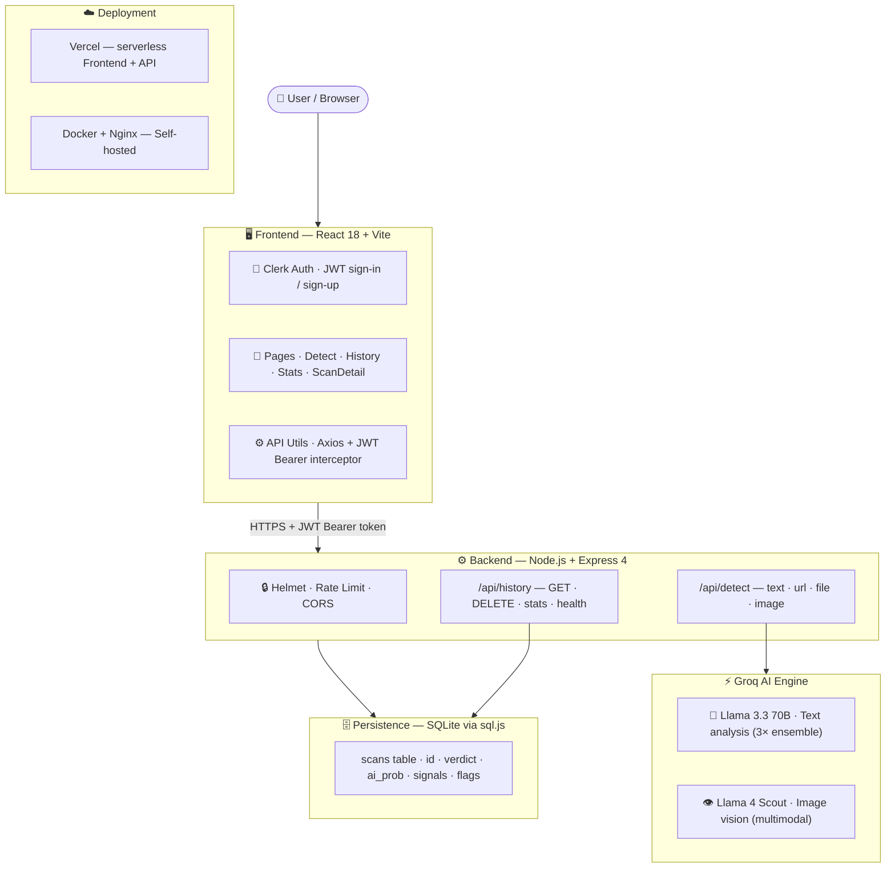
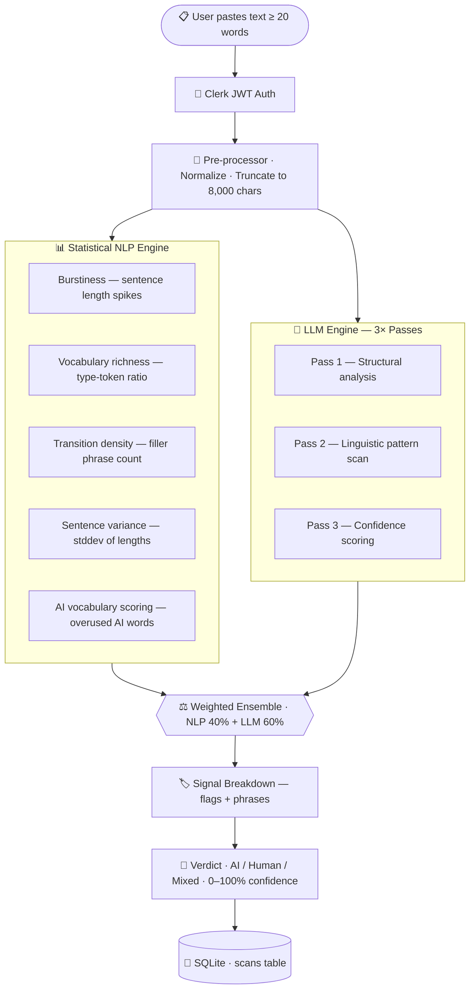
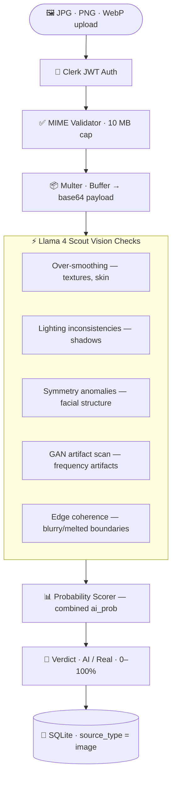
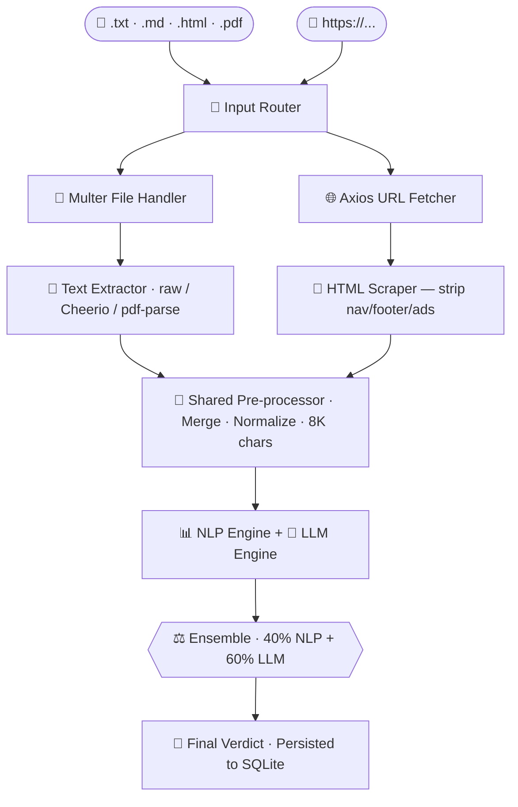

<div align="center">


<br/>

<!-- Status Badges Row -->
[](https://vercel.com)
[](https://nodejs.org)
[](https://console.groq.com)
[](https://clerk.com)
[](./LICENSE)
[](https://github.com/SAMPRIT-NANDI/DETECT-AI-SUPER-CHAMPION)

<br/>

<!-- Typing animation via shields.io readme-typing-svg -->
[](https://git.io/typing-svg)

</div>

<br/>


<br/>

## 🤖 Meet Your AI Detective

<div align="center">

<table>
<tr>
<td align="center" width="220">


**UNIT-7 — Detection Bot**
`STATUS: ONLINE ●`

</td>
<td>

### What Is DetectAI Super Champion?

**DetectAI Super Champion** is a full-stack AI content detection platform that determines whether text, images, or documents were generated by AI or written by a human. It combines **statistical NLP analysis** with **LLM-based reasoning** via Groq's ultra-fast inference for high-confidence verdicts.

> 💡 *Trained on 60,000+ samples — 25,180 human-written and 35,254 AI-generated across GPT-4o, Claude, and Gemini.*
┌─────────────────────────────────────────────────┐
│  INPUT  ──► ANALYZE ──► VERDICT ──► HISTORY     │
│                                                  │
│  Text / URL / File / Image                       │
│  Statistical NLP + Groq LLM Ensemble             │
│  AI · Human · Mixed  (0–100% confidence)         │
└─────────────────────────────────────────────────┘

</td>
</tr>
</table>

</div>

<br/>


<br/>

## ✨ Feature Matrix

<div align="center">


</div>

<br/>

| 🔧 Feature | 📝 Description | ⚡ Engine |
|---|---|---|
| 📝 **Text Detection** | Paste any text ≥ 20 words for AI probability analysis | Llama 3.3 70B × 3 passes |
| 🌐 **URL Detection** | Scrape + analyze content from any public URL | Cheerio + Groq |
| 📄 **File Upload** | `.txt` `.md` `.html` `.pdf` up to 10 MB | Multer + pdf-parse |
| 🖼️ **Image Detection** | JPG · PNG · WebP AI-generated visual detection | Llama 4 Scout Vision |
| 📊 **Stats Dashboard** | Aggregated scan trends and breakdowns | sql.js + Chart rendering |
| 📋 **Scan History** | Browse, inspect, delete past scans | SQLite + REST API |
| 🔒 **Authentication** | Clerk-powered sign-in/sign-up + JWT-secured routes | @clerk/express |
| ⚡ **Real-time Speed** | Results delivered in under **2 seconds** | Groq LPU Inference |

<br/>


<br/>

## 🏛️ System Architecture



<br/>


<br/>

## 🧠 AI Text Detection Pipeline



<br/>


<br/>

## 🖼️ AI Image Detection Pipeline



<br/>


<br/>

## 🌐 File & URL Detection Pipeline



<br/>


<br/>

## 🏗️ Project Structure

```
╔══════════════════════════════════════════════════════════════╗
║          DETECT-AI-SUPER-CHAMPION  —  File Tree              ║
╠══════════════════════════════════════════════════════════════╣
║  📁 api/                                                     ║
║  │  └── index.js              Vercel serverless entry point  ║
║  │                                                           ║
║  📁 backend/                                                 ║
║  │  ├── server.js             Express + CORS + Helmet        ║
║  │  ├── db.js                 SQLite via sql.js               ║
║  │  └── routes/                                              ║
║  │      ├── detect.js         POST /api/detect/*             ║
║  │      ├── factcheck.js      POST /api/factcheck            ║
║  │      └── history.js        GET/DELETE /api/history        ║
║  │                                                           ║
║  📁 frontend/src/                                            ║
║  │  ├── App.jsx               Root + Clerk + React Router    ║
║  │  ├── components/                                          ║
║  │  │   ├── ClerkApiSetup.jsx JWT interceptor                ║
║  │  │   ├── Navbar.jsx                                       ║
║  │  │   ├── Results.jsx       Rich detection results UI      ║
║  │  │   └── UI.jsx            Gauge · SignalBar · Badge      ║
║  │  └── pages/                                               ║
║  │      ├── Detect.jsx        Main detection page (4 modes)  ║
║  │      ├── History.jsx       Scan history list              ║
║  │      ├── ScanDetail.jsx    Individual scan view           ║
║  │      └── Stats.jsx         Statistics dashboard           ║
║  │                                                           ║
║  📄 vercel.json               Vercel deployment config       ║
║  📄 docker-compose.yml        Docker production setup        ║
║  📄 package.json              Root scripts                   ║
╚══════════════════════════════════════════════════════════════╝
```

<br/>


<br/>

## ⚙️ Tech Stack

<div align="center">

| Layer | Technology | Badge |
|---|---|---|
| **Frontend** | React 18 · Vite · React Router v6 |  |
| **Auth** | Clerk — JWT sign-in/sign-up |  |
| **Backend** | Node.js · Express 4 |  |
| **Database** | SQLite via `sql.js` (pure JS) |  |
| **AI Engine** | Groq — Llama 4 Scout + Llama 3.3 70B |  |
| **Scraping** | Axios + Cheerio |  |
| **Uploads** | Multer (10 MB limit) |  |
| **Security** | Helmet · express-rate-limit · CORS |  |
| **Deploy** | Vercel serverless **or** Docker + Nginx |  |

</div>

<br/>


<br/>

## 🚀 Quick Start (Local Dev)

<div align="center">

[](https://git.io/typing-svg)

</div>

### 1 — Clone & Install

```bash
git clone https://github.com/SAMPRIT-NANDI/DETECT-AI-SUPER-CHAMPION.git
cd DETECT-AI-SUPER-CHAMPION
npm run install:all
```

### 2 — Configure Environment

**`backend/.env`**
```env
PORT=4001
GROQ_API_KEY=gsk_your_key_here          # → console.groq.com
FRONTEND_URL=http://localhost:5174
CLERK_PUBLISHABLE_KEY=pk_test_your_key  # → dashboard.clerk.com
CLERK_SECRET_KEY=sk_test_your_key
```

**`frontend/.env`**
```env
VITE_CLERK_PUBLISHABLE_KEY=pk_test_your_key
```

### 3 — Start Dev Servers

```bash
npm run dev
# ⚡ Backend  → http://localhost:4001
# 🖥️ Frontend → http://localhost:5174
```

<br/>


<br/>

## 🌐 Deploy to Vercel

```
┌─────────────────────────────────────────────────────────────┐
│  1. Push to GitHub                                          │
│  2. Import at vercel.com → single project (not services)   │
│  3. Build Command:   npm run build                          │
│  4. Output Dir:      frontend/dist                          │
│  5. Add env vars:    GROQ_API_KEY                           │
│                      CLERK_SECRET_KEY                       │
│                      VITE_CLERK_PUBLISHABLE_KEY             │
│  6. Click Deploy ✓   vercel.json handles the rest           │
└─────────────────────────────────────────────────────────────┘
```

> ✅ The included `vercel.json` automatically routes `/api/*` to the serverless function and all other routes to the React SPA.

<br/>

## 🐳 Docker (Self-Hosted)

```bash
cp backend/.env.example backend/.env
# Fill in API keys

docker-compose up --build
# 🖥️  Frontend  → http://localhost:80   (Nginx)
# ⚙️  Backend   → http://localhost:4001 (Express)
```

<br/>


<br/>

## 🔌 API Reference

> All `/api/detect/*` routes require `Authorization: Bearer <clerk_jwt>`

```http
# ── Text ──────────────────────────────────────────
POST /api/detect/text
{ "text": "Your text here (≥ 20 words)..." }

# ── URL ───────────────────────────────────────────
POST /api/detect/url
{ "url": "https://example.com/article" }

# ── File (multipart) ──────────────────────────────
POST /api/detect/file
file: <upload>   # .txt .md .html .pdf — max 10 MB

# ── Image (multipart) ─────────────────────────────
POST /api/detect/image
file: <upload>   # .jpg .jpeg .png .webp — max 10 MB

# ── History ───────────────────────────────────────
GET    /api/history?page=1&limit=20    # paginated list
GET    /api/history/:id                # single scan
DELETE /api/history/:id                # delete scan
GET    /api/history/stats              # aggregated stats
GET    /api/health                     # health check
```

<br/>


<br/>

## 🗄️ Database Schema

SQLite managed by `sql.js` — pure JavaScript, zero native deps, serverless-compatible.

| Column | Type | Description |
|---|---|---|
| `id` | TEXT UUID | Primary key |
| `created_at` | DATETIME | Timestamp |
| `source_type` | TEXT | `text` · `url` · `file` · `image` |
| `source_ref` | TEXT | URL or filename |
| `input_text` | TEXT | First 500 chars of input |
| `word_count` | INTEGER | Total word count |
| `verdict` | TEXT | `AI` · `Human` · `Mixed` |
| `ai_prob` | REAL | Score 0–100 |
| `confidence` | TEXT | `Low` · `Medium` · `High` · `Very High` |
| `summary` | TEXT | Human-readable analysis summary |
| `signals` | TEXT | JSON — signal category scores |
| `ai_flags` | TEXT | JSON — AI-pattern indicators |
| `human_flags` | TEXT | JSON — human-pattern indicators |
| `phrases` | TEXT | JSON — flagged phrases |
| `ip_address` | TEXT | Client IP |

<br/>


<br/>

## 🔒 Security

```
┌──────────────────────┬──────────────────────────────────────┐
│ Rate Limiting        │ 30 req/min per IP on /api/detect     │
│ File Size Cap        │ 10 MB maximum upload                 │
│ Text Truncation      │ Input capped at 8,000 characters     │
│ CORS                 │ Restricted to FRONTEND_URL only      │
│ HTTP Headers         │ Secured via Helmet middleware         │
│ Authentication       │ All API routes: Clerk JWT verified   │
└──────────────────────┴──────────────────────────────────────┘
```

<br/>


<br/>

## 📊 Dataset Evaluation

> Evaluated across multiple topics and training epochs across 60,000+ samples.

<div align="center">


</div>

<br/>


<br/>

## 👥 Contributors

<div align="center">

Built with 🤖 for **Hackathon 2026**

| | Name | GitHub |
|---|---|---|
| 🧑‍💻 | **Samprit Nandi** | [](https://github.com/SAMPRIT-NANDI) |
| 🧑‍💻 | **Sania Parveen** | [](https://github.com) |
| 🧑‍💻 | **Sambhab Rooj** | [](https://github.com) |
| 🧑‍💻 | **Rohit Banerjee** | [](https://github.com) |

</div>

<br/>


<br/>

<div align="center">


[](https://git.io/typing-svg)

**[MIT](./LICENSE) © 2026 — DetectAI Super Champion**

`[ UNIT-7 SIGNING OFF... GOOD HUNTING ]`

</div>
